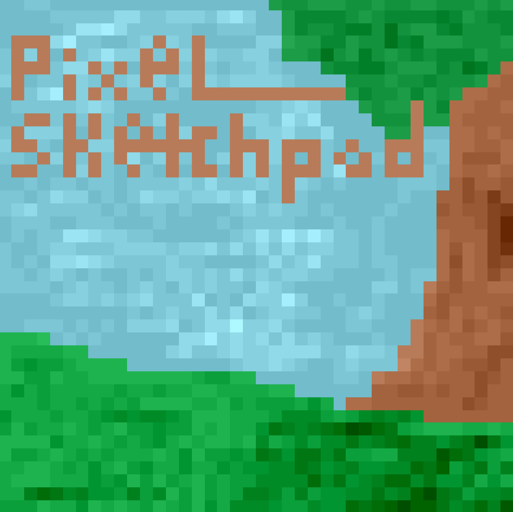
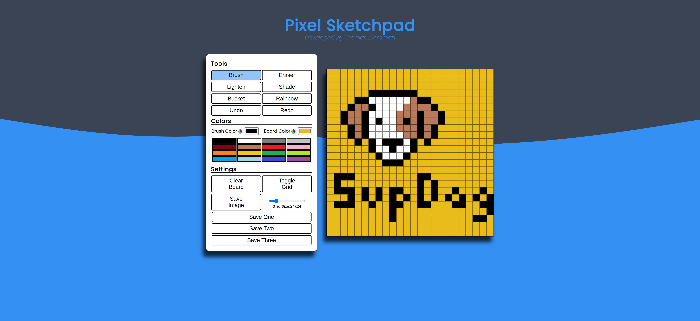
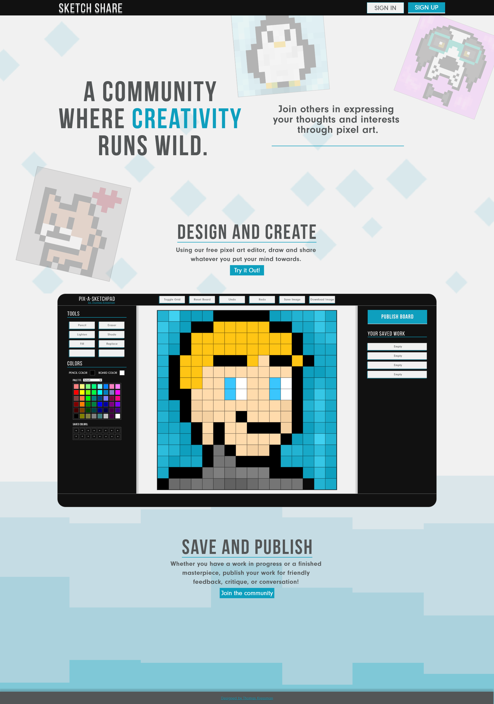
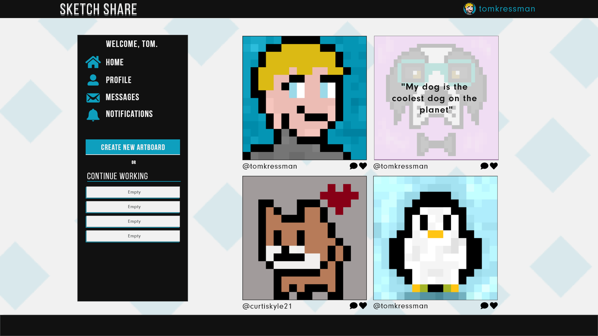
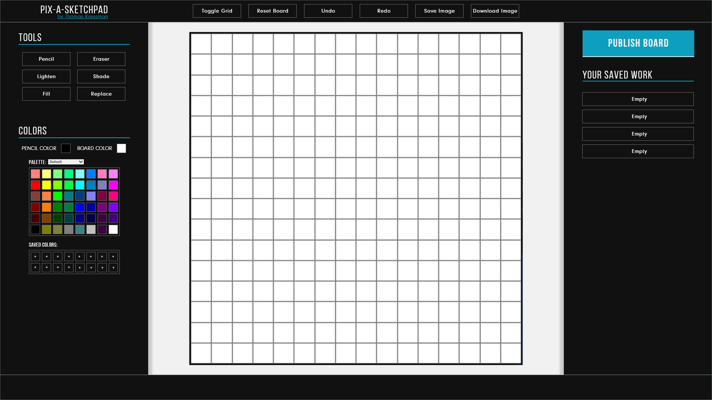

# Pixel Sketchpad - An Interactive Web Application

This is a web application built using vanilla JavaScript, HTML, and CSS inspired by MS Paint.

## Built with

- Flexbox
- CSS Grid
- JavaScript

## Why?

I always enjoyed playing around in MS Paint, though I am certaintly not the most talented at drawing. I wanted a fun project to refresh my mind on DOM manipulation concepts and figured an MS Paint-like application would be perfect. 

This project requried me to think outside the box when dealing with the functionality of various tools. 

- Arguably the easiest tools to implement were the brush and eraser tools. When a grid-item is interacted with, update the values associated with the tool being used.
- The lighten and shade tools required me to understand the RGB color model and how subtracting or adding values to it effects the color. 
- The bucket tool required me to implement an algorithm known as ["flood fill"](https://en.wikipedia.org/wiki/Flood_fill), which recursively colors each grid item in a four-way pattern (one step north, south, east, and west to the selected node). 
- The undo and redo buttons made use of arrays to keep track of each change in the drawing board, popping or adding to the array based on the action taken. 

I hope whoever decides to check this out has a fun time playing around with the various tools provided. Happy drawing! 

### Screenshot

### Continued development

I had (or still have?) plans to develop a full stack social media application based around this pixel sketchpad. The main concept is that users speak their thoughts through their art and share it to their followers. 

Below is some concept artboards I designed using Adobe XD.

## Author

- Twitter - [@tom_kressman](https://www.twitter.com/tom_kressman)

